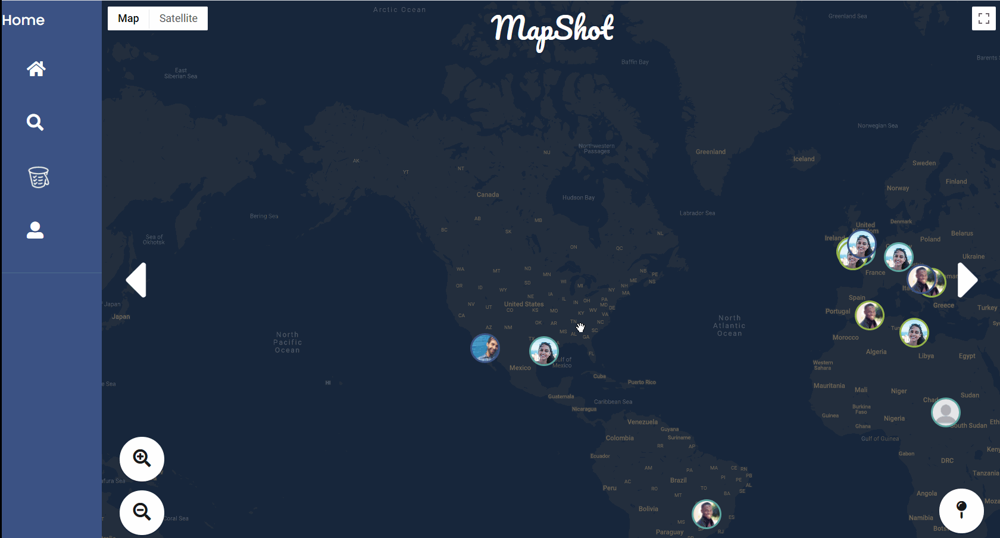

MapShot
==================
Social media application that lets users track life events by pushing "pins" onto a map. These pins can include titles, pictures, descriptions, and tags which help to categorize users pins. This is a proof of concept application.  

Technologies
-----

## Front End
HTML

EJS

CSS

Bootstrap

Javascript

jQuery

## Back End
NodeJS

Express

MySQL

